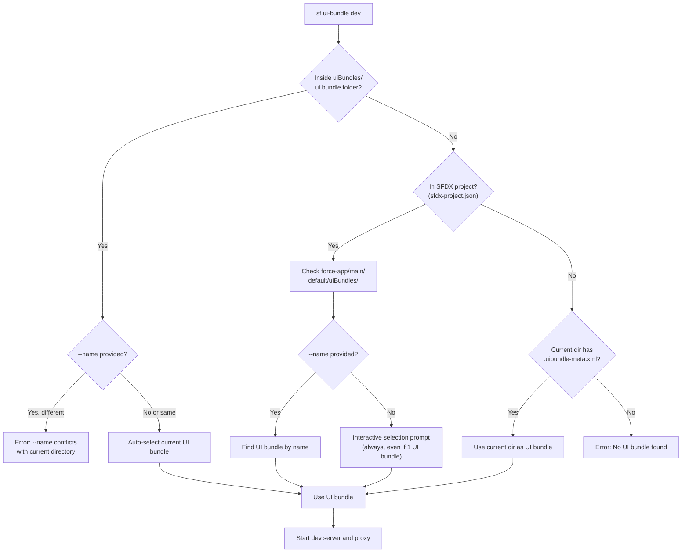

# Salesforce UI Bundle Dev Command Guide

> **Develop UI bundles with seamless Salesforce integration**

---

## Overview

The `sf ui-bundle dev` command enables local development of modern web applications (React, Vue, Angular, etc.) with automatic Salesforce authentication. It intelligently discovers your UI bundle configuration, handles proxy routing, injects authentication headers, and supports hot reload - so you can focus on building your UI bundle.

### Key Features

- **Auto-Discovery**: Automatically finds UI bundles in `uiBundles/` folder
- **Optional Manifest**: `ui-bundle.json` is optional - uses sensible defaults
- **Auto-Selection**: Automatically selects UI bundle when running from inside its folder
- **Interactive Selection**: Prompts with arrow-key navigation when multiple UI bundles exist
- **Authentication Injection**: Automatically adds Salesforce auth headers to API calls
- **Intelligent Routing**: Routes requests to dev server or Salesforce based on URL patterns
- **Hot Module Replacement**: Full HMR support for Vite, Webpack, and other bundlers
- **Error Detection**: Displays helpful error pages with fix suggestions
- **Framework Agnostic**: Works with any web framework

---

## Quick Start

### 1. Create your UI bundle in the SFDX project structure

```
my-sfdx-project/
├── sfdx-project.json
└── force-app/main/default/uiBundles/
    └── my-bundle/
        ├── my-bundle.uibundle-meta.xml
        ├── package.json
        ├── src/
        └── ui-bundle.json
```

### 2. Run the command

```bash
sf ui-bundle dev --target-org myOrg --open
```

### 3. Start developing

Browser opens to `http://localhost:4545` with your UI bundle running and Salesforce authentication ready.

> **Note**:
>
> - `{name}.uibundle-meta.xml` is **required** to identify a valid UI bundle
> - `ui-bundle.json` is optional for dev configuration. If not present, defaults to:
>   - **Name**: From meta.xml filename or folder name
>   - **Dev command**: `npm run dev`
>   - **Manifest watching**: Disabled

---

## Command Syntax

```bash
sf ui-bundle dev [OPTIONS]
```

### Options

| Option         | Short | Description                      | Default       |
| -------------- | ----- | -------------------------------- | ------------- |
| `--target-org` | `-o`  | Salesforce org alias or username | Required      |
| `--name`       | `-n`  | UI bundle name (folder name)     | Auto-discover |
| `--url`        | `-u`  | Explicit dev server URL          | Auto-detect   |
| `--port`       | `-p`  | Proxy server port                | 4545          |
| `--open`       | `-b`  | Open browser automatically       | false         |

### Examples

```bash
# Simplest - auto-discovers ui-bundle.json
sf ui-bundle dev --target-org myOrg

# With browser auto-open
sf ui-bundle dev --target-org myOrg --open

# Specify UI bundle by name (when multiple exist)
sf ui-bundle dev --name myBundle --target-org myOrg

# Custom port
sf ui-bundle dev --target-org myOrg --port 8080

# Explicit dev server URL (skip auto-detection)
sf ui-bundle dev --target-org myOrg --url http://localhost:5173

# Debug mode
SF_LOG_LEVEL=debug sf ui-bundle dev --target-org myOrg
```

---

## UI Bundle Discovery

The command discovers UI bundles using a simplified, deterministic algorithm. UI bundles are identified by the presence of a `{name}.uibundle-meta.xml` file (SFDX metadata format). The optional `ui-bundle.json` file provides dev configuration.

### How Discovery Works



### Discovery Behavior

| Scenario                             | Behavior                                                     |
| ------------------------------------ | ------------------------------------------------------------ |
| `--name myBundle` provided           | Finds UI bundle by name, starts dev server                   |
| Running from inside UI bundle folder | Auto-selects that UI bundle                                  |
| `--name` conflicts with current dir  | Error: must match current UI bundle or run from project root |
| At SFDX project root                 | **Always prompts** for UI bundle selection                   |
| Outside SFDX project with meta.xml   | Uses current directory as standalone UI bundle               |
| No UI bundle found                   | Shows error with helpful message                             |

### Folder Structure (SFDX Project)

```
my-sfdx-project/
├── sfdx-project.json                      # SFDX project marker
└── force-app/main/default/
    └── uiBundles/                         # Standard SFDX location
        ├── bundle-one/                       # UI Bundle 1 (with dev config)
        │   ├── bundle-one.uibundle-meta.xml  # Required: identifies as UI bundle
        │   ├── ui-bundle.json                # Optional: dev configuration
        │   ├── package.json
        │   └── src/
        └── bundle-two/                       # UI Bundle 2 (no dev config)
            ├── bundle-two.uibundle-meta.xml  # Required
            ├── package.json
            └── src/
```

### Discovery Strategy

The command uses a simplified, deterministic approach:

1. **Inside UI bundle folder**: If running from `uiBundles/<bundle>/` or deeper, auto-selects that UI bundle
2. **SFDX project root**: Uses fixed path `force-app/main/default/uiBundles/`
3. **Standalone**: If current directory has a `.uibundle-meta.xml` file, uses it directly

**Important**: Only directories containing a `{name}.uibundle-meta.xml` file are recognized as valid UI bundles.

### Interactive Selection

When multiple UI bundles are found, you'll see an interactive prompt:

```
Found 3 UI bundles in project
? Select the UI bundle to run: (Use arrow keys)
❯ bundle-one (uiBundles/bundle-one)
  bundle-two (uiBundles/bundle-two) [no manifest]
  bundle-three (uiBundles/bundle-three)
```

Format:

- **With manifest**: `folder-name (path)`
- **No manifest**: `folder-name (path) [no manifest]`

---

## Architecture

### Request Flow

```
┌─────────────────────────────────────────────────┐
│              Your Browser                        │
│         http://localhost:4545                    │
└───────────────────┬─────────────────────────────┘
                    │
                    ▼
┌─────────────────────────────────────────────────┐
│           Proxy Server (Port 4545)               │
│                                                  │
│   Routes requests based on URL pattern:          │
│   • /services/* → Salesforce (with auth)         │
│   • Everything else → Dev Server                 │
└─────────┬─────────────────────┬─────────────────┘
          │                     │
          ▼                     ▼
┌─────────────────┐   ┌────────────────────────┐
│   Dev Server    │   │   Salesforce Instance  │
│ (localhost:5173)│   │  + Auth Headers Added  │
│   React/Vue/etc │   │  + API Calls           │
└─────────────────┘   └────────────────────────┘
```

### How Requests Are Handled

**Static assets (JS, CSS, HTML, images):**

```
Browser → Proxy → Dev Server → Response
```

**Salesforce API calls (`/services/*`):**

```
Browser → Proxy → [Auth Headers Injected] → Salesforce → Response
```

---

## Configuration

### Dev Server URL Resolution

The command operates in two distinct modes based on configuration:

| Mode              | Configuration                                   | Behavior                                                                                                                                         |
| ----------------- | ----------------------------------------------- | ------------------------------------------------------------------------------------------------------------------------------------------------ |
| **Command mode**  | `dev.command` is set (or default `npm run dev`) | CLI starts the dev server. URL defaults to `http://localhost:5173`. Override with `dev.url` or `--url` if your dev server uses a different port. |
| **URL-only mode** | `dev.url` or `--url` only (no `dev.command`)    | CLI assumes the dev server is already running. Does **not** start the dev server. Starts proxy only and forwards to the given URL.               |

**URL precedence:** `--url` flag > `dev.url` in manifest > default `http://localhost:5173` (when command is used)

### ui-bundle.json Schema

The `ui-bundle.json` file is **optional**. All fields are also optional - missing fields use defaults.

#### Dev Configuration

| Field         | Type   | Description                                                                                                                                                                  | Default                 |
| ------------- | ------ | ---------------------------------------------------------------------------------------------------------------------------------------------------------------------------- | ----------------------- |
| `dev.command` | string | Command to start the dev server (e.g., `npm run dev`). When set, the CLI starts the dev server and uses default URL `http://localhost:5173` unless overridden.               | `npm run dev`           |
| `dev.url`     | string | Dev server URL. **Command mode**: Override the default 5173 port if needed. **URL-only mode**: Required—the CLI assumes the server is already running and does not start it. | `http://localhost:5173` |

**Command mode (CLI starts dev server):**

```json
{
  "dev": {
    "command": "npm run dev"
  }
}
```

- CLI runs `npm run dev` and waits for the server to be ready
- Default URL: `http://localhost:5173`
- Override port: add `"url": "http://localhost:3000"` if your dev server uses a different port

**URL-only mode (proxy only, server already running):**

```json
{
  "dev": {
    "url": "http://localhost:5173"
  }
}
```

- No `dev.command` — CLI does **not** start the dev server
- You must start the dev server yourself (e.g., `npm run dev` in another terminal)
- CLI starts only the proxy and forwards to the given URL

**No manifest (uses defaults):**

- Dev command: `npm run dev`
- Default URL: `http://localhost:5173`
- Manifest watching: disabled

#### Routing Configuration (Optional)

```json
{
  "routing": {
    "rewrites": [{ "route": "/api/:path*", "target": "/services/apexrest/:path*" }],
    "redirects": [{ "route": "/old-path", "target": "/new-path", "statusCode": 301 }],
    "trailingSlash": "never",
    "fallback": "/index.html"
  }
}
```

### Example: Minimal (No Manifest)

```
uiBundles/
└── my-bundle/
    ├── package.json     # Has "scripts": { "dev": "vite" }
    └── src/
```

Run: `sf ui-bundle dev --target-org myOrg`

Console output:

```
Warning: No ui-bundle.json found for UI bundle "my-bundle"
    Location: my-bundle
    Using defaults:
    → Name: "my-bundle" (derived from folder)
    → Command: "npm run dev"
    → Manifest watching: disabled
    💡 To customize, create a ui-bundle.json file in your UI bundle directory.

✅ Using UI bundle: my-bundle (uiBundles/my-bundle)

✅ Ready for development!
    → Proxy:      http://localhost:4545 (open this in your browser)
    → Dev server: http://localhost:5173
Press Ctrl+C to stop
```

### Example: Dev + Routing

```json
{
  "dev": {
    "command": "npm run dev"
  },
  "routing": {
    "rewrites": [{ "route": "/api/:path*", "target": "/services/apexrest/:path*" }],
    "trailingSlash": "never"
  }
}
```

---

## Features

### Manifest Hot Reload

Edit `ui-bundle.json` while running - changes apply automatically:

```bash
# Console output when you change ui-bundle.json:
Manifest changed detected
✓ Manifest reloaded successfully
Dev server URL updated to: http://localhost:5174
```

> **Note**: Manifest watching is only enabled when `ui-bundle.json` exists. UI bundles without manifests don't have this feature.

### Health Monitoring

The proxy continuously monitors dev server availability:

- Displays "No Dev Server Detected" page when server is down
- Auto-refreshes when server comes back up
- Shows helpful suggestions for common issues

### WebSocket Support

Full Hot Module Replacement support through the proxy:

- Vite HMR (`/@vite/*`, `/__vite_hmr`)
- Webpack HMR (`/__webpack_hmr`)
- Works with React Fast Refresh, Vue HMR, etc.

### Code Builder Support

Automatically detects Salesforce Code Builder environment and binds to `0.0.0.0` for proper port forwarding in cloud environments.

---

## The `--url` Flag

The `--url` flag overrides the dev server URL. Behavior depends on whether you have a command configured:

| Scenario          | Command in manifest? | `--url` behavior                                                                                                     |
| ----------------- | -------------------- | -------------------------------------------------------------------------------------------------------------------- |
| URL-only mode     | No                   | Required. CLI assumes the server is already running and does not start it. Use when you run the dev server yourself. |
| Command mode      | Yes                  | Optional override. Default is `http://localhost:5173`. Use `--url` to point to a different port.                     |
| URL reachable     | Either               | Proxy-only: skips starting dev server, starts proxy only                                                             |
| URL not reachable | Yes (command)        | Starts dev server and warns if actual URL differs from `--url`                                                       |
| URL not reachable | No (URL-only)        | Error: server must be running at the given URL                                                                       |

### Connect to Existing Dev Server (Proxy-Only Mode)

When you run the dev server yourself:

```bash
# Terminal 1: Start your dev server manually
cd my-bundle
npm run dev
# Output: Local: http://localhost:5173/

# Terminal 2: Connect proxy to your running server
sf ui-bundle dev --url http://localhost:5173 --target-org myOrg
```

**Output:**

```
✅ URL http://localhost:5173 is already available, skipping dev server startup (proxy-only mode)
✅ Ready for development!
   → http://localhost:4545 (open this URL in your browser)
```

### Override Default Port (Command Mode)

When using `dev.command`, the default URL is `http://localhost:5173`. Override with `--url` if your dev server uses a different port:

```bash
sf ui-bundle dev --url http://localhost:3000 --target-org myOrg
```

If the URL is not reachable, the CLI starts the dev server and uses the actual URL (with a warning if it differs).

---

## Troubleshooting

### "No UI bundle found" or "No valid UI bundles"

Ensure your UI bundle has the required `.uibundle-meta.xml` file:

```
force-app/main/default/uiBundles/
└── my-bundle/
    ├── my-bundle.uibundle-meta.xml   # Required!
    ├── package.json
    └── ui-bundle.json                # Optional (for dev config)
```

The `.uibundle-meta.xml` file identifies a valid SFDX UI bundle. Without it, the directory is ignored.

### "You are inside UI bundle X but specified --name Y"

This error occurs when you're inside one UI bundle folder but try to run a different one:

```bash
# You're in FirstBundle folder but trying to run SecondBundle
cd uiBundles/FirstBundle
sf ui-bundle dev --name SecondBundle --target-org myOrg  # Error!
```

**Solutions:**

- Remove `--name` to use the current UI bundle
- Navigate to the project root and use `--name`
- Navigate to the correct UI bundle folder

### "No UI bundle found with name X"

The `--name` flag matches the folder name of the UI bundle.

```bash
# This looks for UI bundle named "myBundle"
sf ui-bundle dev --name myBundle --target-org myOrg
```

### "Dependencies Not Installed" / "command not found"

Install dependencies in your UI bundle folder:

```bash
cd uiBundles/my-bundle
npm install
```

### "No Dev Server Detected"

1. Ensure dev server is running: `npm run dev`
2. Verify URL in `ui-bundle.json` is correct
3. Try explicit URL: `sf ui-bundle dev --url http://localhost:5173 --target-org myOrg`

### "Port 4545 already in use"

```bash
# Use a different port
sf ui-bundle dev --port 8080 --target-org myOrg

# Or find and kill the process using the port
lsof -i :4545
kill -9 <PID>
```

### "Authentication Failed"

Re-authorize your Salesforce org:

```bash
sf org login web --alias myOrg
```

### Debug Mode

Enable detailed logging by setting `SF_LOG_LEVEL=debug`. Debug logs are written to the SF CLI log file (not stdout).

**Step 1: Start log tail in Terminal 1**

```bash
# Tail today's log file, filtering for UiBundleDev messages
tail -f ~/.sf/sf-$(date +%Y-%m-%d).log | grep --line-buffered UiBundleDev

# Or for cleaner output (requires jq):
tail -f ~/.sf/sf-$(date +%Y-%m-%d).log | grep --line-buffered UiBundleDev | jq -r '.msg'
```

**Step 2: Run command in Terminal 2**

```bash
SF_LOG_LEVEL=debug sf ui-bundle dev --target-org myOrg
```

**Example debug output:**

```
Discovering ui-bundle.json manifest(s)...
Using UI bundle: myBundle at uiBundles/my-bundle
Manifest loaded: myBundle
Starting dev server with command: npm run dev
Dev server ready at: http://localhost:5173/
Using authentication for org: user@example.com
Starting proxy server on port 4545...
Proxy server running on http://localhost:4545
```

---

## VSCode Integration

The command integrates with the Salesforce VSCode UI Preview extension (`salesforcedx-vscode-ui-preview`):

1. Extension detects `ui-bundle.json` in workspace
2. User clicks "Preview" button on the file
3. Extension executes: `sf ui-bundle dev --target-org <org> --open`
4. If multiple UI bundles exist, uses `--name` to specify which one
5. Browser opens with your UI bundle running

---

## JSON Output

For scripting and CI/CD, use the `--json` flag:

```bash
sf ui-bundle dev --target-org myOrg --json
```

Output:

```json
{
  "status": 0,
  "result": {
    "url": "http://localhost:4545",
    "devServerUrl": "http://localhost:5173"
  }
}
```

---

## Plugin Development

### Building the Plugin

```bash
cd /path/to/plugin-ui-bundle-dev

# Install dependencies
yarn install

# Build
yarn build

# Link to SF CLI
sf plugins link .

# Verify installation
sf plugins
```

### After Code Changes

```bash
yarn build  # Rebuild - no re-linking needed
```

### Project Structure

```
plugin-ui-bundle-dev/
├── src/
│   ├── commands/ui-bundle/
│   │   └── dev.ts              # Main command implementation
│   ├── config/
│   │   ├── manifest.ts         # Manifest type definitions
│   │   ├── ManifestWatcher.ts  # File watching and hot reload
│   │   ├── webappDiscovery.ts  # Auto-discovery logic
│   │   └── types.ts            # Shared TypeScript types
│   ├── proxy/
│   │   ├── ProxyServer.ts      # HTTP/WebSocket proxy server
│   │   ├── handler.ts          # Request routing and forwarding
│   │   └── routing.ts          # URL pattern matching
│   └── server/
│       └── DevServerManager.ts # Dev server process management
├── messages/
│   └── ui-bundle.dev.md        # CLI messages and help text
└── schemas/
    └── ui__bundle-dev.json     # JSON schema for output
```

### Key Components

| Component             | Purpose                                        |
| --------------------- | ---------------------------------------------- |
| `dev.ts`              | Command orchestration and lifecycle            |
| `webappDiscovery.ts`  | SFDX project detection and UI bundle discovery |
| `ProxyServer.ts`      | HTTP proxy with WebSocket support              |
| `DevServerManager.ts` | Dev server process spawning and monitoring     |
| `ManifestWatcher.ts`  | ui-bundle.json file watching for hot reload    |

---

**Repository:** [github.com/salesforcecli/plugin-ui-bundle-dev](https://github.com/salesforcecli/plugin-ui-bundle-dev)
