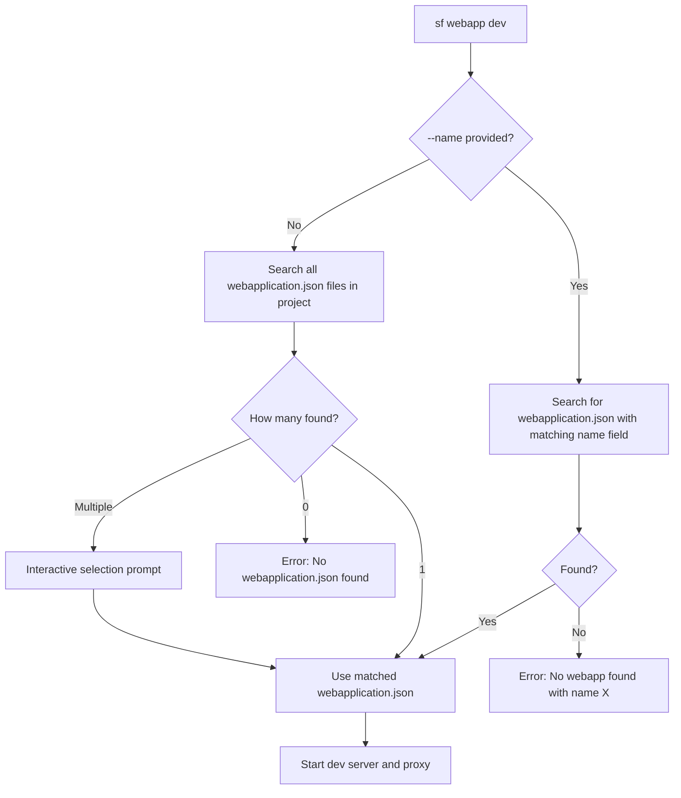

# Salesforce Webapp Dev Command Guide

> **Develop web applications with seamless Salesforce integration**

---

## Overview

The `sf webapp dev` command enables local development of modern web applications (React, Vue, Angular, etc.) with automatic Salesforce authentication. It intelligently discovers your webapp configuration, handles proxy routing, injects authentication headers, and supports hot reload - so you can focus on building your app.

### Key Features

- **Auto-Discovery**: Automatically finds `webapplication.json` files in your project
- **Interactive Selection**: Prompts with arrow-key navigation when multiple webapps exist
- **Authentication Injection**: Automatically adds Salesforce auth headers to API calls
- **Intelligent Routing**: Routes requests to dev server or Salesforce based on URL patterns
- **Hot Module Replacement**: Full HMR support for Vite, Webpack, and other bundlers
- **Error Detection**: Displays helpful error pages with fix suggestions
- **Framework Agnostic**: Works with any web framework

---

## Quick Start

### 1. Create `webapplication.json` in your project

```json
{
  "name": "myApp",
  "label": "My Application",
  "version": "1.0.0",
  "outputDir": "dist",
  "dev": {
    "command": "npm run dev"
  }
}
```

### 2. Run the command

```bash
sf webapp dev --target-org myOrg --open
```

### 3. Start developing

Browser opens to `http://localhost:4545` with your app running and Salesforce authentication ready.

---

## Command Syntax

```bash
sf webapp dev [OPTIONS]
```

### Options

| Option         | Short | Description                                     | Default       |
| -------------- | ----- | ----------------------------------------------- | ------------- |
| `--target-org` | `-o`  | Salesforce org alias or username                | Required      |
| `--name`       | `-n`  | Web application name (from webapplication.json) | Auto-discover |
| `--url`        | `-u`  | Explicit dev server URL                         | Auto-detect   |
| `--port`       | `-p`  | Proxy server port                               | 4545          |
| `--open`       | `-b`  | Open browser automatically                      | false         |

### Examples

```bash
# Simplest - auto-discovers webapplication.json
sf webapp dev --target-org myOrg

# With browser auto-open
sf webapp dev --target-org myOrg --open

# Specify webapp by name (when multiple exist)
sf webapp dev --name myApp --target-org myOrg

# Custom port
sf webapp dev --target-org myOrg --port 8080

# Explicit dev server URL (skip auto-detection)
sf webapp dev --target-org myOrg --url http://localhost:5173

# Debug mode
SF_LOG_LEVEL=debug sf webapp dev --target-org myOrg
```

---

## Webapp Discovery

The command automatically discovers `webapplication.json` files in your project, making the `--name` flag optional in most cases.

### How Discovery Works



### Discovery Behavior

| Scenario                         | Behavior                                                    |
| -------------------------------- | ----------------------------------------------------------- |
| `--name myApp` provided          | Finds webapplication.json where `name` field equals "myApp" |
| No `--name`, single webapp found | Auto-selects the webapp                                     |
| No `--name`, multiple found      | Shows interactive selection with arrow keys                 |
| No `--name`, none found          | Shows error with helpful message                            |

### Search Scope

The command searches the current directory and all subdirectories, excluding:

- `node_modules`
- `.git`
- `dist`, `build`, `out`
- `coverage`
- `.next`, `.nuxt`, `.output`
- Hidden directories (starting with `.`)

### Interactive Selection

When multiple `webapplication.json` files are found, you'll see an interactive prompt:

```
Found 3 webapplication.json files in project
? Select the webapp to run: (Use arrow keys)
❯ myApp - My Application (webapplication.json)
  adminPortal - Admin Portal (apps/admin/webapplication.json)
  dashboard - Dashboard App (packages/dashboard/webapplication.json)
```

Use arrow keys to navigate and Enter to select.

---

## Architecture

### Request Flow

```
┌─────────────────────────────────────────────────┐
│              Your Browser                        │
│         http://localhost:4545                    │
└───────────────────┬─────────────────────────────┘
                    │
                    ▼
┌─────────────────────────────────────────────────┐
│           Proxy Server (Port 4545)               │
│                                                  │
│   Routes requests based on URL pattern:          │
│   • /services/* → Salesforce (with auth)         │
│   • Everything else → Dev Server                 │
└─────────┬─────────────────────┬─────────────────┘
          │                     │
          ▼                     ▼
┌─────────────────┐   ┌────────────────────────┐
│   Dev Server    │   │   Salesforce Instance  │
│ (localhost:5173)│   │  + Auth Headers Added  │
│   React/Vue/etc │   │  + API Calls           │
└─────────────────┘   └────────────────────────┘
```

### How Requests Are Handled

**Static assets (JS, CSS, HTML, images):**

```
Browser → Proxy → Dev Server → Response
```

**Salesforce API calls (`/services/*`):**

```
Browser → Proxy → [Auth Headers Injected] → Salesforce → Response
```

---

## Configuration

### webapplication.json Schema

#### Required Fields

```json
{
  "name": "myApp",
  "label": "My Application",
  "version": "1.0.0",
  "outputDir": "dist"
}
```

| Field       | Type   | Description                               |
| ----------- | ------ | ----------------------------------------- |
| `name`      | string | Unique identifier (used with --name flag) |
| `label`     | string | Human-readable display name               |
| `version`   | string | Semantic version (e.g., "1.0.0")          |
| `outputDir` | string | Build output directory                    |

#### Dev Configuration

**Option A: Auto-spawn dev server**

```json
{
  "dev": {
    "command": "npm run dev"
  }
}
```

The command will spawn your dev server and automatically detect its URL.

**Option B: Explicit URL (dev server already running)**

```json
{
  "dev": {
    "url": "http://localhost:5173"
  }
}
```

Use this when you want to start the dev server yourself.

#### Routing Configuration (Optional)

```json
{
  "routing": {
    "rewrites": [{ "route": "/api/:path*", "target": "/services/apexrest/:path*" }],
    "redirects": [{ "route": "/old-path", "target": "/new-path", "statusCode": 301 }],
    "trailingSlash": "never",
    "fallback": "/index.html"
  }
}
```

### Complete Example

```json
{
  "name": "salesDashboard",
  "label": "Sales Dashboard",
  "description": "Real-time sales analytics dashboard",
  "version": "2.1.0",
  "outputDir": "dist",
  "dev": {
    "command": "npm run dev"
  },
  "routing": {
    "rewrites": [{ "route": "/api/:path*", "target": "/services/apexrest/:path*" }],
    "trailingSlash": "never"
  }
}
```

---

## Features

### Manifest Hot Reload

Edit `webapplication.json` while running - changes apply automatically:

```bash
# Console output when you change webapplication.json:
Manifest changed detected
✓ Manifest reloaded successfully
Dev server URL updated to: http://localhost:5174
```

### Health Monitoring

The proxy continuously monitors dev server availability:

- Displays "No Dev Server Detected" page when server is down
- Auto-refreshes when server comes back up
- Shows helpful suggestions for common issues

### WebSocket Support

Full Hot Module Replacement support through the proxy:

- Vite HMR (`/@vite/*`, `/__vite_hmr`)
- Webpack HMR (`/__webpack_hmr`)
- Works with React Fast Refresh, Vue HMR, etc.

### Code Builder Support

Automatically detects Salesforce Code Builder environment and binds to `0.0.0.0` for proper port forwarding in cloud environments.

---

## Troubleshooting

### "No webapplication.json found"

Ensure you have a `webapplication.json` file with required fields:

```json
{
  "name": "myApp",
  "label": "My Application",
  "version": "1.0.0",
  "outputDir": "dist"
}
```

### "No webapp found with name X"

The `--name` flag matches the `name` field inside `webapplication.json`, not the file path:

```bash
# This looks for webapplication.json where name="myApp"
sf webapp dev --name myApp --target-org myOrg
```

Check your `webapplication.json` content to verify the name.

### "No Dev Server Detected"

1. Ensure dev server is running: `npm run dev`
2. Verify URL in `webapplication.json` is correct
3. Try explicit URL: `sf webapp dev --url http://localhost:5173 --target-org myOrg`

### "Port 4545 already in use"

```bash
# Use a different port
sf webapp dev --port 8080 --target-org myOrg

# Or find and kill the process using the port
lsof -i :4545
kill -9 <PID>
```

### "Authentication Failed"

Re-authorize your Salesforce org:

```bash
sf org login web --alias myOrg
```

### Debug Mode

Enable detailed logging:

```bash
SF_LOG_LEVEL=debug sf webapp dev --target-org myOrg
```

---

## VSCode Integration

The command integrates with the Salesforce VSCode UI Preview extension (`salesforcedx-vscode-ui-preview`):

1. Extension detects `webapplication.json` in workspace
2. User clicks "Preview" button on the file
3. Extension executes: `sf webapp dev --target-org <org> --open`
4. If multiple webapps exist, uses `--name` to specify which one
5. Browser opens with the app running

---

## JSON Output

For scripting and CI/CD, use the `--json` flag:

```bash
sf webapp dev --target-org myOrg --json
```

Output:

```json
{
  "status": 0,
  "result": {
    "url": "http://localhost:4545",
    "devServerUrl": "http://localhost:5173"
  }
}
```

---

## Plugin Development

### Building the Plugin

```bash
cd /path/to/plugin-webapp

# Install dependencies
yarn install

# Build
yarn build

# Link to SF CLI
sf plugins link .

# Verify installation
sf plugins
```

### After Code Changes

```bash
yarn build  # Rebuild - no re-linking needed
```

### Project Structure

```
plugin-webapp/
├── src/
│   ├── commands/webapp/
│   │   └── dev.ts              # Main command implementation
│   ├── auth/
│   │   └── org.ts              # Salesforce authentication
│   ├── config/
│   │   ├── manifest.ts         # Manifest type definitions
│   │   ├── ManifestWatcher.ts  # File watching and hot reload
│   │   ├── webappDiscovery.ts  # Auto-discovery logic
│   │   └── types.ts            # Shared TypeScript types
│   ├── proxy/
│   │   ├── ProxyServer.ts      # HTTP/WebSocket proxy server
│   │   ├── handler.ts          # Request routing and forwarding
│   │   └── routing.ts          # URL pattern matching
│   ├── server/
│   │   └── DevServerManager.ts # Dev server process management
│   ├── error/
│   │   ├── ErrorHandler.ts     # Error creation utilities
│   │   ├── DevServerErrorParser.ts
│   │   └── ErrorPageRenderer.ts
│   └── templates/
│       └── error-page.html     # Error page template
├── messages/
│   └── webapp.dev.md           # CLI messages and help text
└── schemas/
    └── webapp-dev.json         # JSON schema for output
```

### Key Components

| Component              | Purpose                                          |
| ---------------------- | ------------------------------------------------ |
| `dev.ts`               | Command orchestration and lifecycle              |
| `webappDiscovery.ts`   | Recursive webapplication.json discovery          |
| `org.ts`               | Salesforce authentication token management       |
| `ProxyServer.ts`       | HTTP proxy with WebSocket support                |
| `handler.ts`           | Request routing to dev server or Salesforce      |
| `DevServerManager.ts`  | Dev server process spawning and monitoring       |
| `ManifestWatcher.ts`   | webapplication.json file watching for hot reload |
| `ErrorPageRenderer.ts` | Browser error page generation                    |

---

**Repository:** [github.com/salesforcecli/plugin-webapp](https://github.com/salesforcecli/plugin-webapp)
