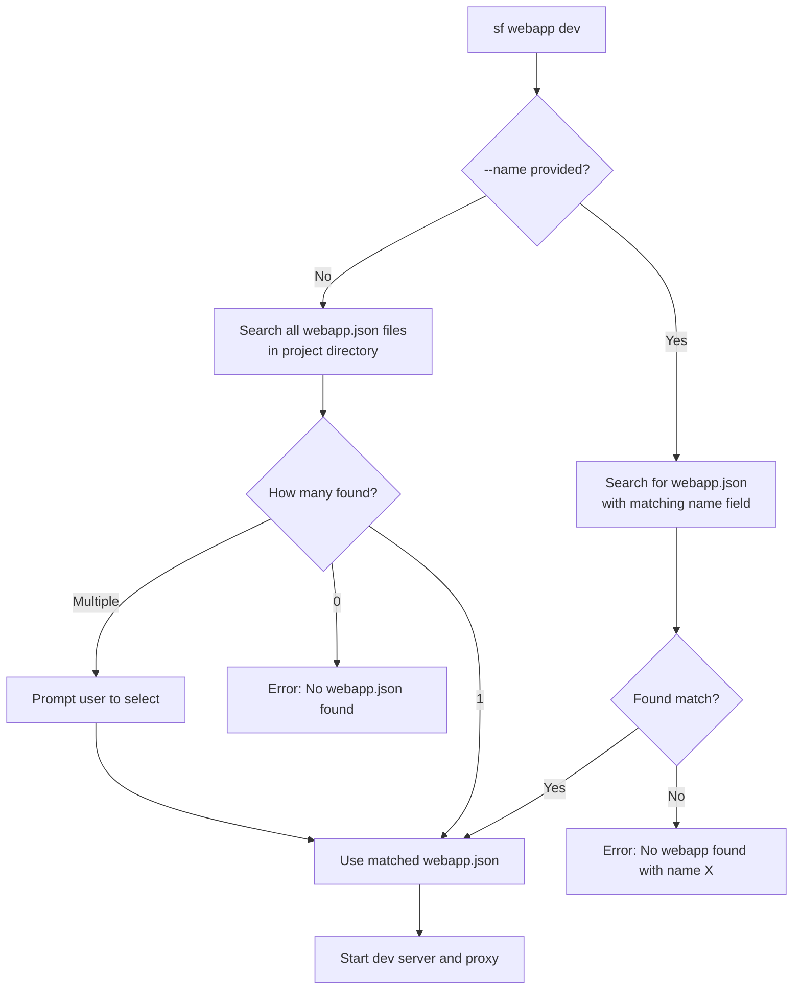

# Salesforce Webapp Dev Command Guide

> **Develop web applications with seamless Salesforce integration**

---

## Overview

The `sf webapp dev` command lets you develop modern web applications (React, Vue, Angular, etc.) with automatic Salesforce authentication. It handles proxy routing, auth injection, and hot reload so you can focus on building your app.

### Key Benefits

- ✅ Automatic Salesforce authentication injection
- ✅ Intelligent request routing (dev server vs Salesforce)
- ✅ Hot Module Replacement (HMR) support
- ✅ Error detection and display
- ✅ Works with any web framework
- ✅ Auto-discovers webapp.json in project

---

## Quick Start

### 1. Create `webapp.json` in your project root

```json
{
  "name": "myApp",
  "label": "My Application",
  "version": "1.0.0",
  "outputDir": "dist",
  "dev": {
    "command": "npm run dev"
  }
}
```

Or with explicit URL (if dev server is already running):

```json
{
  "name": "myApp",
  "label": "My Application",
  "version": "1.0.0",
  "outputDir": "dist",
  "dev": {
    "url": "http://localhost:5173"
  }
}
```

### 2. Run the command

```bash
# Auto-discovers webapp.json (simplest)
sf webapp dev --target-org myOrg --open

# Or specify webapp by name
sf webapp dev --name myApp --target-org myOrg --open
```

### 3. Start developing

Browser opens to `http://localhost:4545` with your app running and Salesforce authentication ready.

---

## Webapp Discovery Flow

The command intelligently discovers and selects webapp.json files:



### Discovery Behavior

| Scenario                         | Behavior                                                   |
| -------------------------------- | ---------------------------------------------------------- |
| `--name myApp` provided          | Searches for webapp.json where `name` field equals "myApp" |
| No `--name`, 1 webapp.json found | Auto-selects the single webapp                             |
| No `--name`, multiple found      | Prompts user to select from list                           |
| No `--name`, none found          | Shows error with helpful message                           |

### Search Scope

The command searches the current directory and all subdirectories, excluding:

- `node_modules`
- `.git`
- `dist`, `build`, `out`
- `coverage`
- Hidden directories (starting with `.`)

---

## Command Options

```bash
sf webapp dev [OPTIONS]
```

| Option         | Short | Description                             | Default       |
| -------------- | ----- | --------------------------------------- | ------------- |
| `--name`       | `-n`  | Web application name (from webapp.json) | Auto-discover |
| `--target-org` | `-o`  | Salesforce org alias                    | Required      |
| `--url`        | `-u`  | Explicit dev server URL                 | Auto-detect   |
| `--port`       | `-p`  | Proxy server port                       | 4545          |
| `--open`       | `-b`  | Open browser automatically              | false         |

### Debug Logging

Enable debug logs using the environment variable:

```bash
SF_LOG_LEVEL=debug sf webapp dev --target-org myOrg
```

---

## How It Works

```
┌─────────────────────────────────────────────────┐
│              Your Browser                        │
│         http://localhost:4545                    │
└───────────────────┬─────────────────────────────┘
                    │
                    ▼
┌─────────────────────────────────────────────────┐
│           Proxy Server (Port 4545)               │
│                                                  │
│   Routes requests based on URL pattern:          │
│   • /services/* → Salesforce (with auth)         │
│   • Everything else → Dev Server                 │
└─────────┬─────────────────────┬─────────────────┘
          │                     │
          ▼                     ▼
┌─────────────────┐   ┌────────────────────────┐
│   Dev Server    │   │   Salesforce Instance  │
│ (localhost:5173)│   │  + Auth Headers Added  │
│   React/Vue/etc │   │  + API Calls           │
└─────────────────┘   └────────────────────────┘
```

### Request Flow

**Static assets (JS, CSS, HTML):**

```
Browser → Proxy → Dev Server → Response
```

**Salesforce API calls:**

```
Browser → Proxy → [Auth Headers Injected] → Salesforce → Response
```

---

## Configuration (webapp.json)

### Required Fields

```json
{
  "name": "myApp",
  "label": "My Application",
  "version": "1.0.0",
  "outputDir": "dist"
}
```

### Dev Configuration

**Option A: Command to spawn dev server**

```json
{
  "dev": {
    "command": "npm run dev"
  }
}
```

**Option B: Explicit URL (dev server already running)**

```json
{
  "dev": {
    "url": "http://localhost:5173"
  }
}
```

### Routing Configuration (Optional)

```json
{
  "routing": {
    "rewrites": [{ "source": "/api/:path*", "destination": "/services/apexrest/:path*" }],
    "redirects": [{ "source": "/old-path", "destination": "/new-path", "permanent": true }]
  }
}
```

---

## Building the Plugin

### For Plugin Developers

```bash
# Build
cd /path/to/plugin-webapp
yarn build

# Link to SF CLI
sf plugins link .

# Verify
sf plugins
```

### After Code Changes

```bash
yarn build  # Just rebuild - no re-linking needed
```

---

## File Structure

```
plugin-webapp/
├── src/
│   ├── commands/webapp/
│   │   └── dev.ts              # Main command
│   ├── auth/
│   │   └── org.ts              # Salesforce authentication
│   ├── proxy/
│   │   ├── ProxyServer.ts      # HTTP proxy server
│   │   ├── handler.ts          # Request handling
│   │   └── routing.ts          # URL routing logic
│   ├── server/
│   │   └── DevServerManager.ts # Dev server lifecycle
│   ├── config/
│   │   ├── manifest.ts         # Manifest types
│   │   ├── ManifestWatcher.ts  # Hot reload config
│   │   ├── webappDiscovery.ts  # Webapp auto-discovery
│   │   └── types.ts            # TypeScript types
│   ├── error/
│   │   ├── ErrorHandler.ts     # Error utilities
│   │   ├── DevServerErrorParser.ts # Parse dev server errors
│   │   └── ErrorPageRenderer.ts    # Error page HTML
│   └── templates/
│       └── error-page.html     # Error page template
├── messages/
│   └── webapp.dev.md           # User messages
└── schemas/
    └── webapp-dev.json         # Output schema
```

### Key Components

| Component              | Purpose                                        |
| ---------------------- | ---------------------------------------------- |
| `dev.ts`               | Main command orchestrator                      |
| `org.ts`               | Salesforce auth token management               |
| `ProxyServer.ts`       | HTTP proxy, routing, WebSocket support         |
| `handler.ts`           | Request forwarding to dev server or Salesforce |
| `DevServerManager.ts`  | Spawns and monitors dev server process         |
| `ManifestWatcher.ts`   | Watches webapp.json for changes                |
| `webappDiscovery.ts`   | Auto-discovers webapp.json files in project    |
| `ErrorPageRenderer.ts` | Renders error pages in browser                 |

---

## Features

### Manifest Hot Reload

Change `dev.url` in `webapp.json` while running - proxy updates automatically:

```bash
# Console output when you change webapp.json:
Manifest changed detected
✓ Manifest reloaded successfully
Dev server URL updated to: http://localhost:5174
```

### Health Monitoring

The proxy continuously checks dev server health:

- Shows "No Dev Server Detected" page when server is down
- Auto-refreshes when server comes back up
- Displays helpful fix suggestions

### WebSocket Support

Hot Module Replacement works through the proxy:

- Vite HMR (`/@vite/*`)
- Webpack HMR
- Works with React, Vue, Angular, etc.

### Code Builder Support

Automatically detects Salesforce Code Builder environment and binds to `0.0.0.0` for port forwarding.

---

## Troubleshooting

### "No Dev Server Detected"

1. Verify dev server is running: `npm run dev`
2. Check URL in `webapp.json`
3. Try explicit URL: `--url http://localhost:5173`

### "Port 4545 already in use"

```bash
# Use different port
sf webapp dev --port 8080 --target-org myOrg

# Or kill existing process
lsof -i :4545 | xargs kill -9
```

### "No webapp.json found"

Ensure you have a `webapp.json` file in your project root or subdirectory with at least the required fields:

```json
{
  "name": "myApp",
  "label": "My Application",
  "version": "1.0.0",
  "outputDir": "dist"
}
```

### "No webapp found with name X"

The `--name` flag matches against the `name` field inside `webapp.json`, not the directory or file path. Check your webapp.json content.

### "Authentication Failed"

```bash
# Re-authorize org
sf org login web --alias myOrg
```

### Debug Mode

```bash
SF_LOG_LEVEL=debug sf webapp dev --target-org myOrg
```

---

## VSCode Integration

The command integrates with VSCode's Live Preview extension (`salesforcedx-vscode-ui-preview`):

1. Extension detects `webapp.json` in workspace
2. User clicks "Preview" button
3. Extension executes: `sf webapp dev --target-org <org> --open` (or with `--name` if multiple webapps)
4. Browser opens with app running

---

## Command Output

When running with `--json` flag, the command outputs:

```json
{
  "url": "http://localhost:4545",
  "devServerUrl": "http://localhost:5173"
}
```

---

**Repository:** [github.com/salesforcecli/plugin-webapp](https://github.com/salesforcecli/plugin-webapp)
