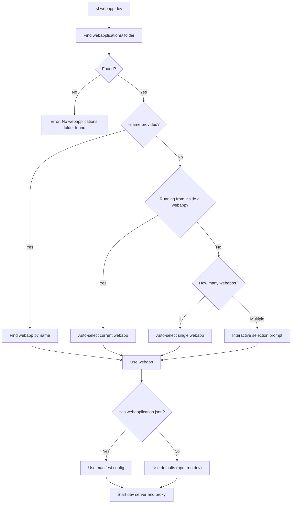

# Salesforce Webapp Dev Command Guide

> **Develop web applications with seamless Salesforce integration**

---

## Overview

The `sf webapp dev` command enables local development of modern web applications (React, Vue, Angular, etc.) with automatic Salesforce authentication. It intelligently discovers your webapp configuration, handles proxy routing, injects authentication headers, and supports hot reload - so you can focus on building your app.

### Key Features

- **Auto-Discovery**: Automatically finds webapps in `webapplications/` folder
- **Optional Manifest**: `webapplication.json` is optional - uses sensible defaults
- **Auto-Selection**: Automatically selects webapp when running from inside its folder
- **Interactive Selection**: Prompts with arrow-key navigation when multiple webapps exist
- **Authentication Injection**: Automatically adds Salesforce auth headers to API calls
- **Intelligent Routing**: Routes requests to dev server or Salesforce based on URL patterns
- **Hot Module Replacement**: Full HMR support for Vite, Webpack, and other bundlers
- **Error Detection**: Displays helpful error pages with fix suggestions
- **Framework Agnostic**: Works with any web framework

---

## Quick Start

### 1. Create your webapp in the `webapplications/` folder

```
my-project/
└── webapplications/
    └── my-app/           # Your webapp folder
        ├── package.json
        ├── src/
        └── webapplication.json  # Optional!
```

### 2. Run the command

```bash
sf webapp dev --target-org myOrg --open
```

### 3. Start developing

Browser opens to `http://localhost:4545` with your app running and Salesforce authentication ready.

> **Note**: `webapplication.json` is optional! If not present, the command uses:
>
> - **Name**: Folder name (e.g., "my-app")
> - **Dev command**: `npm run dev`
> - **Manifest watching**: Disabled

---

## Command Syntax

```bash
sf webapp dev [OPTIONS]
```

### Options

| Option         | Short | Description                                     | Default       |
| -------------- | ----- | ----------------------------------------------- | ------------- |
| `--target-org` | `-o`  | Salesforce org alias or username                | Required      |
| `--name`       | `-n`  | Web application name (from webapplication.json) | Auto-discover |
| `--url`        | `-u`  | Explicit dev server URL                         | Auto-detect   |
| `--port`       | `-p`  | Proxy server port                               | 4545          |
| `--open`       | `-b`  | Open browser automatically                      | false         |

### Examples

```bash
# Simplest - auto-discovers webapplication.json
sf webapp dev --target-org myOrg

# With browser auto-open
sf webapp dev --target-org myOrg --open

# Specify webapp by name (when multiple exist)
sf webapp dev --name myApp --target-org myOrg

# Custom port
sf webapp dev --target-org myOrg --port 8080

# Explicit dev server URL (skip auto-detection)
sf webapp dev --target-org myOrg --url http://localhost:5173

# Debug mode
SF_LOG_LEVEL=debug sf webapp dev --target-org myOrg
```

---

## Webapp Discovery

The command automatically discovers webapps in the `webapplications/` folder. Each subfolder is treated as a webapp, with `webapplication.json` being optional.

### How Discovery Works



### Discovery Behavior

| Scenario                          | Behavior                                       |
| --------------------------------- | ---------------------------------------------- |
| `--name myApp` provided           | Finds webapp by name (manifest name or folder) |
| Running from inside webapp folder | Auto-selects that webapp                       |
| Single webapp found               | Auto-selects it                                |
| Multiple webapps found            | Shows interactive selection with arrow keys    |
| No webapplications folder         | Shows error with helpful message               |

### Folder Structure

```
my-project/
└── webapplications/        # Required folder (case-insensitive)
    ├── app-one/            # Webapp 1 (with manifest)
    │   ├── webapplication.json
    │   ├── package.json
    │   └── src/
    ├── app-two/            # Webapp 2 (no manifest - uses defaults)
    │   ├── package.json
    │   └── src/
    └── app-three/          # Webapp 3 (partial manifest)
        ├── webapplication.json  # Only has dev.command
        └── src/
```

### Search Scope

The command searches for the `webapplications/` folder:

1. **Upward**: First checks if you're inside a webapplications folder
2. **Downward**: Then searches child directories recursively

Excluded directories:

- `node_modules`, `.git`, `dist`, `build`, `out`, `coverage`
- `.next`, `.nuxt`, `.output`
- Hidden directories (starting with `.`)

### Interactive Selection

When multiple webapps are found, you'll see an interactive prompt:

```
Found 3 webapps in project
? Select the webapp to run: (Use arrow keys)
❯ MyApp - My Application (webapplications/app-one)
  app-two (webapplications/app-two) [no manifest]
  CustomName (webapplications/app-three)
```

Format:

- **With manifest + label**: `Name - Label (path)`
- **With manifest, no label**: `Name (path)`
- **No manifest**: `name (path) [no manifest]`

---

## Architecture

### Request Flow

```
┌─────────────────────────────────────────────────┐
│              Your Browser                        │
│         http://localhost:4545                    │
└───────────────────┬─────────────────────────────┘
                    │
                    ▼
┌─────────────────────────────────────────────────┐
│           Proxy Server (Port 4545)               │
│                                                  │
│   Routes requests based on URL pattern:          │
│   • /services/* → Salesforce (with auth)         │
│   • Everything else → Dev Server                 │
└─────────┬─────────────────────┬─────────────────┘
          │                     │
          ▼                     ▼
┌─────────────────┐   ┌────────────────────────┐
│   Dev Server    │   │   Salesforce Instance  │
│ (localhost:5173)│   │  + Auth Headers Added  │
│   React/Vue/etc │   │  + API Calls           │
└─────────────────┘   └────────────────────────┘
```

### How Requests Are Handled

**Static assets (JS, CSS, HTML, images):**

```
Browser → Proxy → Dev Server → Response
```

**Salesforce API calls (`/services/*`):**

```
Browser → Proxy → [Auth Headers Injected] → Salesforce → Response
```

---

## Configuration

### webapplication.json Schema

The `webapplication.json` file is **optional**. All fields are also optional - missing fields use defaults.

#### All Fields (All Optional)

```json
{
  "name": "myApp",
  "label": "My Application",
  "version": "1.0.0",
  "outputDir": "dist",
  "dev": {
    "command": "npm run dev"
  }
}
```

| Field       | Type   | Description                               | Default            |
| ----------- | ------ | ----------------------------------------- | ------------------ |
| `name`      | string | Unique identifier (used with --name flag) | Folder name        |
| `label`     | string | Human-readable display name               | None               |
| `version`   | string | Semantic version (e.g., "1.0.0")          | None               |
| `outputDir` | string | Build output directory                    | None (deploy only) |

#### Dev Configuration

**Option A: No manifest (uses defaults)**

If no `webapplication.json` exists:

- Dev command: `npm run dev`
- Name: folder name
- Manifest watching: disabled

**Option B: Minimal manifest**

```json
{
  "dev": {
    "command": "npm start"
  }
}
```

Only specify what you need to override.

**Option C: Explicit URL (dev server already running)**

```json
{
  "dev": {
    "url": "http://localhost:5173"
  }
}
```

Use this when you want to start the dev server yourself.

#### Routing Configuration (Optional)

```json
{
  "routing": {
    "rewrites": [{ "route": "/api/:path*", "target": "/services/apexrest/:path*" }],
    "redirects": [{ "route": "/old-path", "target": "/new-path", "statusCode": 301 }],
    "trailingSlash": "never",
    "fallback": "/index.html"
  }
}
```

### Example: Minimal (No Manifest)

```
webapplications/
└── my-dashboard/
    ├── package.json     # Has "scripts": { "dev": "vite" }
    └── src/
```

Run: `sf webapp dev --target-org myOrg`

Console output:

```
Warning: No webapplication.json found for webapp "my-dashboard"
    Location: my-dashboard
    Using defaults:
    → Name: "my-dashboard" (derived from folder)
    → Command: "npm run dev"
    → Manifest watching: disabled
    💡 To customize, create a webapplication.json file in your webapp directory.

✅ Using webapp: my-dashboard (webapplications/my-dashboard)

✅ Ready for development!
    → Proxy:      http://localhost:4545 (open this in your browser)
    → Dev server: http://localhost:5173
Press Ctrl+C to stop
```

### Example: Full Configuration

```json
{
  "name": "salesDashboard",
  "label": "Sales Dashboard",
  "description": "Real-time sales analytics dashboard",
  "version": "2.1.0",
  "outputDir": "dist",
  "dev": {
    "command": "npm run dev"
  },
  "routing": {
    "rewrites": [{ "route": "/api/:path*", "target": "/services/apexrest/:path*" }],
    "trailingSlash": "never"
  }
}
```

---

## Features

### Manifest Hot Reload

Edit `webapplication.json` while running - changes apply automatically:

```bash
# Console output when you change webapplication.json:
Manifest changed detected
✓ Manifest reloaded successfully
Dev server URL updated to: http://localhost:5174
```

> **Note**: Manifest watching is only enabled when `webapplication.json` exists. Webapps without manifests don't have this feature.

### Health Monitoring

The proxy continuously monitors dev server availability:

- Displays "No Dev Server Detected" page when server is down
- Auto-refreshes when server comes back up
- Shows helpful suggestions for common issues

### WebSocket Support

Full Hot Module Replacement support through the proxy:

- Vite HMR (`/@vite/*`, `/__vite_hmr`)
- Webpack HMR (`/__webpack_hmr`)
- Works with React Fast Refresh, Vue HMR, etc.

### Code Builder Support

Automatically detects Salesforce Code Builder environment and binds to `0.0.0.0` for proper port forwarding in cloud environments.

---

## Troubleshooting

### "No webapplications folder found"

Create a `webapplications/` folder with at least one webapp subfolder:

```
my-project/
└── webapplications/
    └── my-app/
        └── package.json
```

Note: `webapplication.json` is optional!

### "No webapp found with name X"

The `--name` flag matches either:

1. The `name` field in `webapplication.json`
2. The folder name (if no manifest or no name in manifest)

```bash
# This looks for webapp named "myApp"
sf webapp dev --name myApp --target-org myOrg
```

### "Dependencies Not Installed" / "command not found"

Install dependencies in your webapp folder:

```bash
cd webapplications/my-app
npm install
```

### "No Dev Server Detected"

1. Ensure dev server is running: `npm run dev`
2. Verify URL in `webapplication.json` is correct
3. Try explicit URL: `sf webapp dev --url http://localhost:5173 --target-org myOrg`

### "Port 4545 already in use"

```bash
# Use a different port
sf webapp dev --port 8080 --target-org myOrg

# Or find and kill the process using the port
lsof -i :4545
kill -9 <PID>
```

### "Authentication Failed"

Re-authorize your Salesforce org:

```bash
sf org login web --alias myOrg
```

### Debug Mode

Enable detailed logging by setting `SF_LOG_LEVEL=debug`. Debug logs are written to the SF CLI log file (not stdout).

**Step 1: Start log tail in Terminal 1**

```bash
# Tail today's log file, filtering for webapp messages
tail -f ~/.sf/sf-$(date +%Y-%m-%d).log | grep --line-buffered WebappDev

# Or for cleaner output (requires jq):
tail -f ~/.sf/sf-$(date +%Y-%m-%d).log | grep --line-buffered WebappDev | jq -r '.msg'
```

**Step 2: Run command in Terminal 2**

```bash
SF_LOG_LEVEL=debug sf webapp dev --target-org myOrg
```

**Example debug output:**

```
Discovering webapplication.json manifest(s)...
Using webapp: myApp at webapplications/my-app
Manifest loaded: myApp
Starting dev server with command: npm run dev
Dev server ready at: http://localhost:5173/
Using authentication for org: user@example.com
Starting proxy server on port 4545...
Proxy server running on http://localhost:4545
```

---

## VSCode Integration

The command integrates with the Salesforce VSCode UI Preview extension (`salesforcedx-vscode-ui-preview`):

1. Extension detects `webapplication.json` in workspace
2. User clicks "Preview" button on the file
3. Extension executes: `sf webapp dev --target-org <org> --open`
4. If multiple webapps exist, uses `--name` to specify which one
5. Browser opens with the app running

---

## JSON Output

For scripting and CI/CD, use the `--json` flag:

```bash
sf webapp dev --target-org myOrg --json
```

Output:

```json
{
  "status": 0,
  "result": {
    "url": "http://localhost:4545",
    "devServerUrl": "http://localhost:5173"
  }
}
```

---

## Plugin Development

### Building the Plugin

```bash
cd /path/to/plugin-app-dev

# Install dependencies
yarn install

# Build
yarn build

# Link to SF CLI
sf plugins link .

# Verify installation
sf plugins
```

### After Code Changes

```bash
yarn build  # Rebuild - no re-linking needed
```

### Project Structure

```
plugin-app-dev/
├── src/
│   ├── commands/webapp/
│   │   └── dev.ts              # Main command implementation
│   ├── auth/
│   │   └── org.ts              # Salesforce authentication
│   ├── config/
│   │   ├── manifest.ts         # Manifest type definitions
│   │   ├── ManifestWatcher.ts  # File watching and hot reload
│   │   ├── webappDiscovery.ts  # Auto-discovery logic
│   │   └── types.ts            # Shared TypeScript types
│   ├── proxy/
│   │   ├── ProxyServer.ts      # HTTP/WebSocket proxy server
│   │   ├── handler.ts          # Request routing and forwarding
│   │   └── routing.ts          # URL pattern matching
│   ├── server/
│   │   └── DevServerManager.ts # Dev server process management
│   ├── error/
│   │   ├── ErrorHandler.ts     # Error creation utilities
│   │   ├── DevServerErrorParser.ts
│   │   └── ErrorPageRenderer.ts
│   └── templates/
│       └── error-page.html     # Error page template
├── messages/
│   └── webapp.dev.md           # CLI messages and help text
└── schemas/
    └── webapp-dev.json         # JSON schema for output
```

### Key Components

| Component              | Purpose                                          |
| ---------------------- | ------------------------------------------------ |
| `dev.ts`               | Command orchestration and lifecycle              |
| `webappDiscovery.ts`   | Recursive webapplication.json discovery          |
| `org.ts`               | Salesforce authentication token management       |
| `ProxyServer.ts`       | HTTP proxy with WebSocket support                |
| `handler.ts`           | Request routing to dev server or Salesforce      |
| `DevServerManager.ts`  | Dev server process spawning and monitoring       |
| `ManifestWatcher.ts`   | webapplication.json file watching for hot reload |
| `ErrorPageRenderer.ts` | Browser error page generation                    |

---

**Repository:** [github.com/salesforcecli/plugin-app-dev](https://github.com/salesforcecli/plugin-app-dev)
